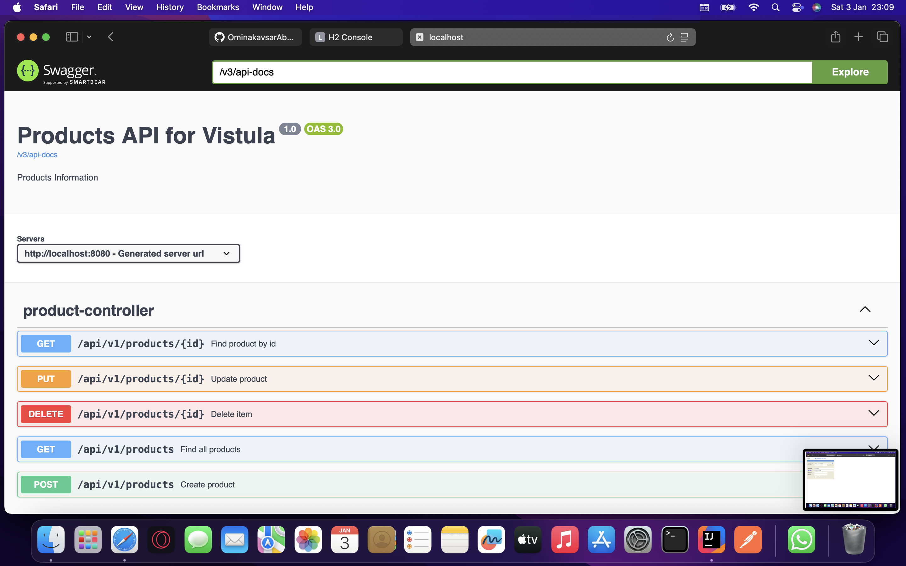
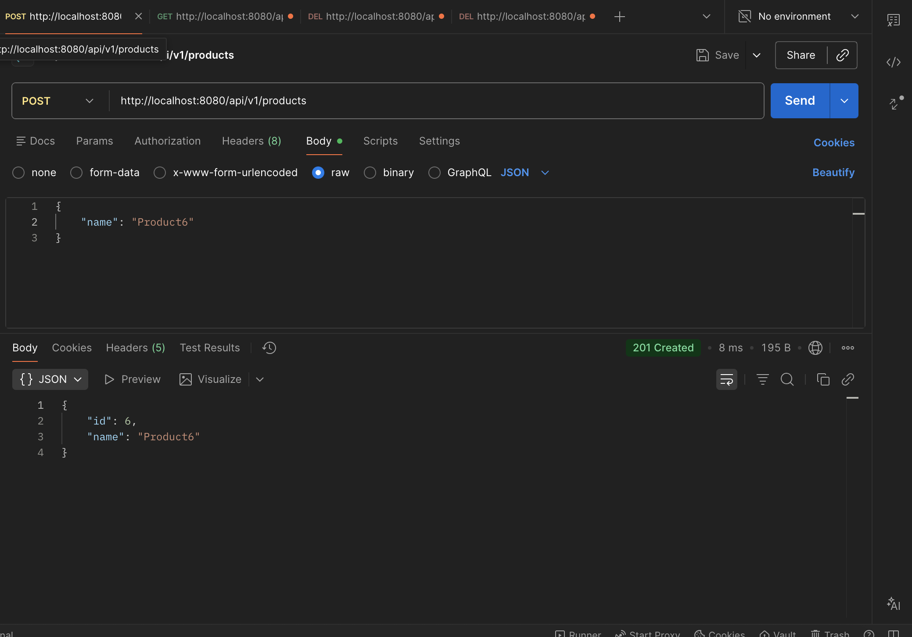
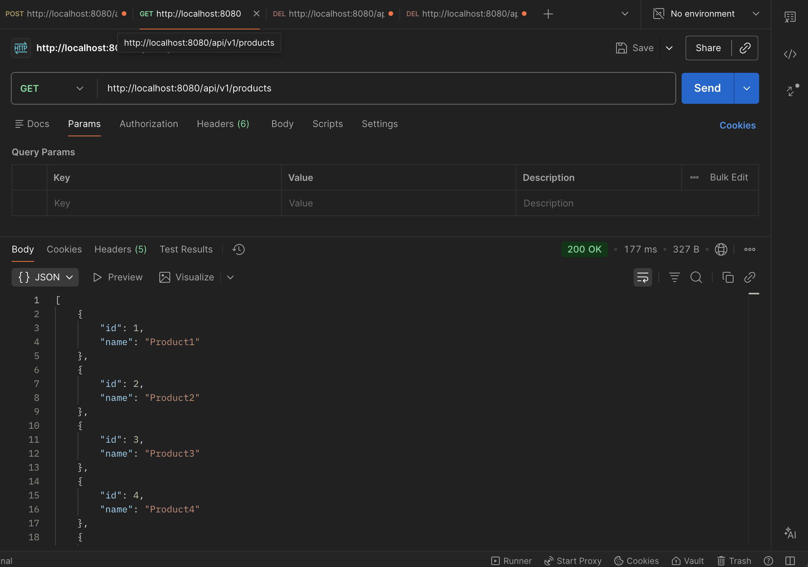
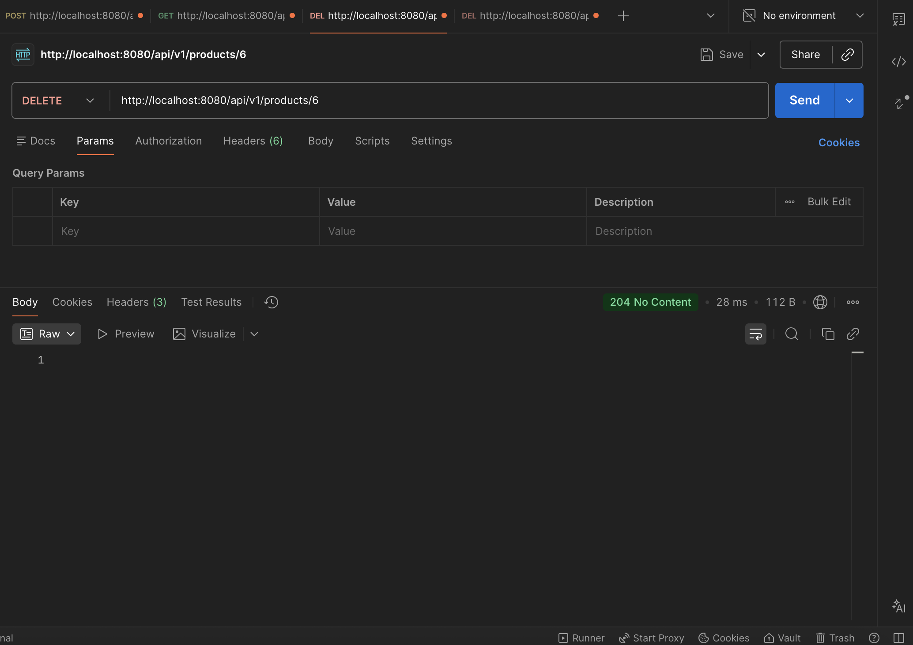
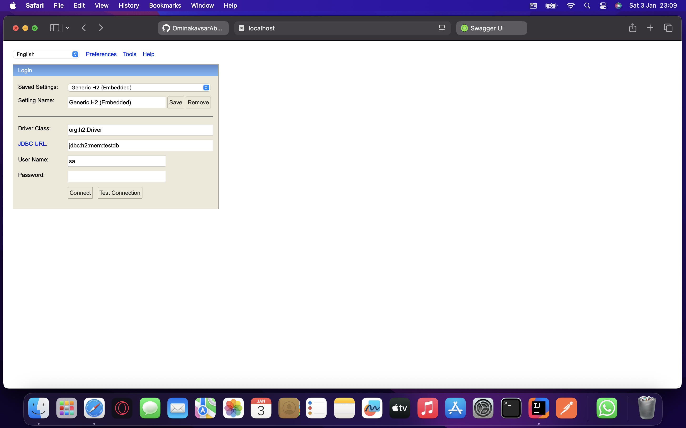
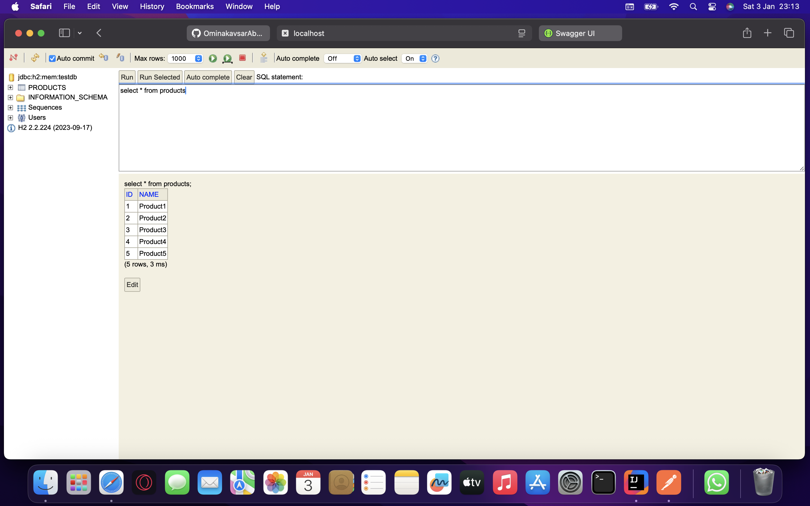

# Spring Boot REST-API TASK2
---

## 🚀 Features

### ✅ create, retrieve, update,delete (CRUP) Operations

### **POST `/api/v1/products` Create a new product**
### **GET `/api/v1/products` Retrieve all products**
### **GET `/api/v1/products/{id}` Retrieve product by ID**
### **PUT `/api/v1/products/{id}` Update an existing product**
### **DELETE `/api/v1/products/{id}` Delete a product**

---

## 📄 SWAGGER:

Interactive API documentation powered by **Swagger / OpenAPI**.

---

## **Post**

---

## **Get**

---

## **Delete**

---

## **error/page 404 (Exception handling)**

---

## Database Integration
- **H2 Console Database**

---

### 📍 Database Access

---

### what i learned from this project
- Java 17 features
- Maven build automation
- database management
- Dependency Injection
- Spring boot

---

## 💻 question 2.G

### **we do not need to write these methods manually because jpa repository already has them**

---
<h2>Created by: ominakavsar Abduganieva</h2>
<h3>Student Id: 74026</h3>
